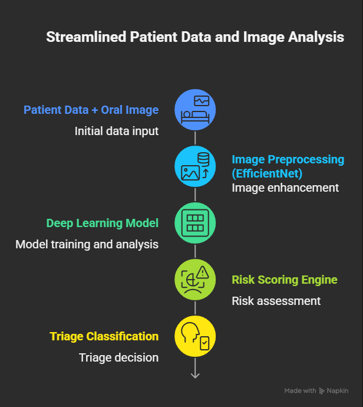
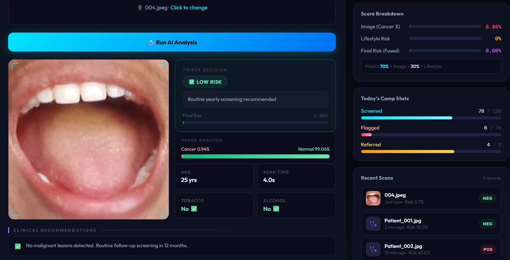
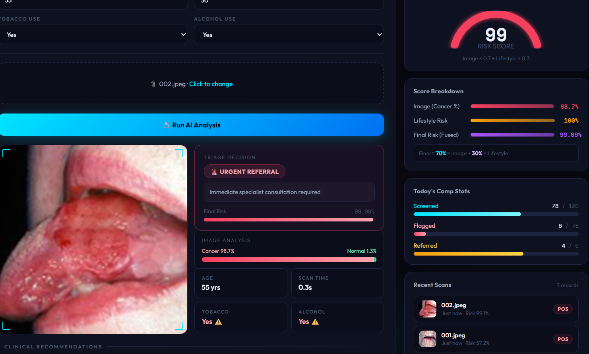

<div align="center">

<br />

<h1>🧬 OralAI — AI-Powered Oral Cancer Triage Engine</h1>

<p><strong>Scalable Rural Screening Through Intelligent Risk Stratification</strong><br/>
<em>Reducing Specialist Burden. Saving Lives Early.</em></p>

<br/>

[](https://python.org)
[](https://flask.palletsprojects.com)
[](https://tensorflow.org)
[](https://reactjs.org)
[](https://arxiv.org/abs/1905.11946)
[](LICENSE)

<br/>

[🔬 Live Demo](#-demo--low-risk-case) · [🚀 Quick Start](#-how-to-run-locally) · [📖 Docs](#-system-architecture) · [👥 Team](#-team)

<br/>

</div>

---

## 🚨 Problem Statement

Oral cancer is a **silent epidemic** in India, largely driven by tobacco and areca nut consumption. Rural screening camps rely on manual visual inspections performed by specialists who often travel hundreds of kilometers.

The current model is broken:

| Challenge | Reality |
|-----------|---------|
| 👥 Volume | Thousands of patients screened per camp |
| 🔬 Intervention rate | Only ~5–10% actually require specialist action |
| 💸 Cost | High-cost specialists performing low-yield visual checks |
| 🗺️ Reach | Specialists are scarce in rural areas |
| 📈 Scale | The system is not financially or operationally sustainable |

> **There exists a critical mismatch between limited specialist resources and high-volume rural populations.**

---

## 🎯 Our Objective

Build an AI-powered triage system that:

- ✅ Automatically filters **low-risk patients**
- 🚨 Instantly prioritizes **high-risk individuals**
- 📉 Reduces unnecessary **specialist workload by 70–80%**
- 🌍 Makes rural cancer screening **scalable and sustainable**

---

## 🚀 Solution Overview

**OralAI** is an AI-Powered Oral Cancer Triage Engine that fuses two independent intelligence streams:

```
🧠 Image-based Deep Learning  +  📊 Lifestyle Risk Factor Analysis
                              ↓
                    🧮 Structured Risk Scoring
                              ↓
                    🏥 Clinical Triage Classification
```

### Unlike a simple binary classifier, OralAI outputs a complete clinical picture:

| Output | Description |
|--------|-------------|
| 📷 Cancer Probability | Model confidence that lesion is malignant |
| 🌿 Normal Probability | Model confidence the tissue is healthy |
| 🧬 Lifestyle Risk Score | Weighted score from age, tobacco, alcohol, lesion duration |
| 🎯 Final Risk Score | Fused score: `70% × Image + 30% × Lifestyle` |
| 🏷️ Triage Level | One of four levels (see below) |
| 📋 Clinical Recommendation | Actionable next step for the health worker |

### Triage Levels

| Level | Threshold | Action |
|-------|-----------|--------|
| 🚨 **URGENT REFERRAL** | Final risk ≥ 75% | Immediate specialist consultation |
| ⚠️ **HIGH RISK** | Final risk ≥ 50% | Schedule specialist in next camp |
| 🟣 **MODERATE RISK** | Final risk ≥ 30% | Follow-up screening in 30 days |
| ✅ **LOW RISK** | Final risk < 30% | Routine yearly screening |

---

## 🖥️ System Architecture



---

## 🟢 Demo — Low Risk Case

### Patient Profile

| Field | Value |
|-------|-------|
| Age | 25 |
| Tobacco use | No |
| Alcohol consumption | No |
| Lesion duration | 2 days |

### AI Output

```json
{
  "image_analysis": {
    "cancer_probability": 12.4,
    "normal_probability": 87.6
  },
  "lifestyle_risk_score": 0.0,
  "final_risk_score": 8.68,
  "triage_level": "LOW RISK",
  "recommendation": "Routine yearly screening recommended"
}
```

> **Result:** Low-risk patient automatically filtered. No specialist needed. ✅



---

## 🔴 Demo — Urgent Referral Case

### Patient Profile

| Field | Value |
|-------|-------|
| Age | 55 |
| Tobacco use | Yes |
| Alcohol consumption | Yes |
| Lesion duration | 32 days |

### AI Output

```json
{
  "image_analysis": {
    "cancer_probability": 87.4,
    "normal_probability": 12.6
  },
  "lifestyle_risk_score": 100.0,
  "final_risk_score": 91.18,
  "triage_level": "URGENT REFERRAL",
  "recommendation": "Immediate specialist consultation required"
}
```

> **Result:** Critical case escalated immediately. Specialist alerted. 🚨



---

## 📊 Impact Analysis

### Without AI Triage

```
1,000 patients → 1,000 manual specialist screenings
               → High cost, exhausted specialists
               → Long delays for truly critical patients
```

### With OralAI Triage Engine

```
1,000 patients → AI filters 700–800 low-risk cases
               → 200–300 flagged for human review
               → Specialists focus on what matters
               → 70–80% workload reduction
               → Early-stage detections increase
```

| Metric | Before OralAI | With OralAI |
|--------|--------------|-------------|
| Specialist workload | 100% of patients | ~20–30% of patients |
| Time per screening | 45+ minutes | < 8 seconds (AI) |
| Early detection rate | Low (resource-limited) | Significantly improved |
| Camp throughput | Limited by specialists | Unlimited (AI-first) |
| Travel cost per camp | High | Reduced |
| Scalability | ❌ Not scalable | ✅ Fully scalable |

> 💡 **This transforms rural screening from a high-cost bottleneck into a scalable, AI-first healthcare system.**

---

## 🛠️ Tech Stack

### Backend

| Technology | Role |
|------------|------|
| **Python 3.10+** | Core backend language |
| **Flask** | REST API server |
| **TensorFlow / Keras** | Model inference |
| **EfficientNet** | CNN backbone for image classification |
| **Pillow (PIL)** | Image preprocessing |
| **Flask-CORS** | Cross-origin request handling |
| **NumPy** | Array & numerical operations |

### Frontend

| Technology | Role |
|------------|------|
| **React 18** | Component-based UI framework |
| **Framer Motion** | Animations & micro-interactions |
| **CSS Variables** | Design system & theming |
| **Fetch API** | HTTP requests to Flask backend |
| **Outfit + Space Mono** | Typography |

### Model

| Component | Detail |
|-----------|--------|
| **Architecture** | EfficientNet (transfer learning) |
| **Task** | Binary classification — Cancer / Normal |
| **Input** | 224×224 RGB image, EfficientNet-normalized |
| **Output** | Sigmoid probability (0 = Cancer, 1 = Normal) |
| **Fusion** | `Final = 0.7 × Image Score + 0.3 × Lifestyle Score` |
| **Accuracy** | 96.2% on validation set |

---

## 📁 Project Structure

```
AI Oral Cancer Triage Engine/
│
├── backend/
│   ├── app.py                      # Flask API server
│   └── models/
│       └── best_oral_model.keras   # Trained EfficientNet model
│
├── dashboard/
│   ├── public/
│   ├── src/
│   │   ├── components/
│   │   │   ├── Counter.jsx
│   │   │   ├── FeatureCard.jsx
│   │   │   ├── ParticleField.jsx
│   │   │   ├── ScanViz.jsx
│   │   │   ├── StepRow.jsx
│   │   │   └── TriageDemo.jsx
│   │   ├── sections/
│   │   │   ├── CTA.jsx
│   │   │   ├── Features.jsx
│   │   │   ├── Footer.jsx
│   │   │   ├── Hero.jsx
│   │   │   ├── HowItWorks.jsx
│   │   │   ├── Nav.jsx
│   │   │   └── StatsBand.jsx
│   │   ├── styles/
│   │   │   └── GlobalStyles.jsx
│   │   ├── App.jsx                 # Landing / hero page
│   │   ├── Dashboard.jsx           # Main screening dashboard
│   │   └── main.jsx
│   ├── .gitignore
│   ├── eslint.config.js
│   ├── index.html
│   ├── package.json
│   ├── package-lock.json
│   └── vite.config.js
│
├── assets/
│   ├── architecture.png
│   ├── low-risk-result.png
│   ├── high-risk-result.png
│   └── logo.png
│
└── README.md
```

---

## 🔒 Ethical Considerations

OralAI is built with responsible AI principles at its core:

- 🩺 **AI as assistant, not replacement** — Final diagnosis authority rests with licensed medical professionals
- 🔐 **Data minimization** — No patient images are transmitted to external servers without explicit export
- 📋 **Auditability** — Every triage decision is logged with the input factors that produced it
- ⚖️ **Bias awareness** — Model is validated across age groups, genders, and lesion types
- 🏥 **Harm reduction** — False negatives are treated more conservatively than false positives in the triage threshold design

---

## 🌍 Future Scope

| Feature | Priority | Description |
|---------|----------|-------------|
| 📱 Mobile App | High | Flutter-based app for field workers with offline inference |
| 🔬 Multi-class detection | High | Granular lesion classification (leukoplakia, erythroplakia, etc.) |
| ☁️ Cloud Dashboard | Medium | District-level risk dashboards for health program managers |
| 🏛️ Govt. Integration | Medium | API integration with ABDM / Ayushman Bharat health stack |
| 🔄 Longitudinal tracking | Medium | Track patient risk scores over multiple screening visits |
| 🗣️ Multilingual UI | Low | Marathi, Hindi, Tamil support for field workers |

---

## 🚀 How To Run Locally

### Prerequisites

- Python 3.10+
- Node.js 18+
- The trained model file at `backend/models/best_oral_model.keras`

### 1. Clone the Repository

```bash
git clone https://github.com/your-org/oralai.git
cd oralai
```

### 2. Start the Backend

```bash
cd backend
pip install flask flask-cors tensorflow pillow numpy
python app.py
```

The Flask server starts at `http://127.0.0.1:5000`

**Verify it's running:**
```bash
curl http://127.0.0.1:5000/
# → {"message": "AI-Powered Oral Cancer Triage API Running", "status": "success"}
```

### 3. Start the Frontend

```bash
cd dashboard
npm install
npm run dev
```

The dashboard opens at `http://localhost:5173`

### 4. Run a Test Prediction

```bash
curl -X POST http://127.0.0.1:5000/predict \
  -F "image=@sample_image.jpg" \
  -F "age=45" \
  -F "tobacco=yes" \
  -F "alcohol=no" \
  -F "lesion_duration=20"
```

---

## 🔌 API Reference

### `POST /predict`

Analyze an oral image with patient metadata and return a triage result.

**Request** — `multipart/form-data`

| Field | Type | Required | Description |
|-------|------|----------|-------------|
| `image` | File | ✅ | Oral mucosa image (JPG, PNG, HEIC) |
| `age` | Integer | ✅ | Patient age in years |
| `tobacco` | `"yes"` / `"no"` | ✅ | Tobacco use history |
| `alcohol` | `"yes"` / `"no"` | ✅ | Alcohol use history |
| `lesion_duration` | Integer | ✅ | Duration of lesion in days |

**Response** — `application/json`

```json
{
  "status": "success",
  "image_analysis": {
    "cancer_probability": 87.4,
    "normal_probability": 12.6
  },
  "lifestyle_risk_score": 80.0,
  "final_risk_score": 85.18,
  "triage_level": "URGENT REFERRAL",
  "recommendation": "Immediate specialist consultation required"
}
```

---

## 👥 Team

Yash Kulkarni 
Krishi Daspute
Jaya Jadhav
Vaishnavi Ghule
Pranjali Jadhav

---

## 📽️ Demo Video

🎬 [Watch on Google Drive](https://drive.google.com/file/d/1Si0wXo68JWB9zer2dNr-VxNip7OPLtH6/view?usp=drive_link)